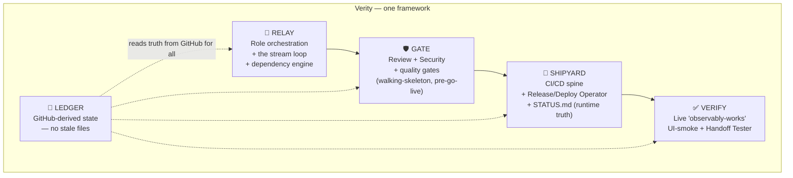
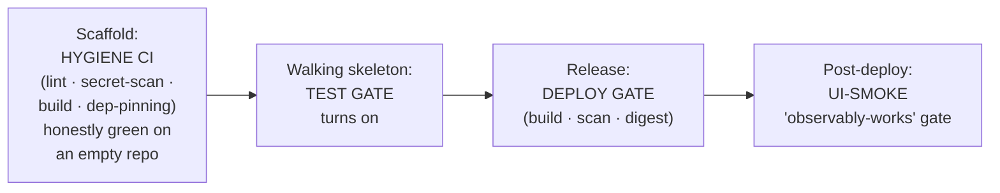
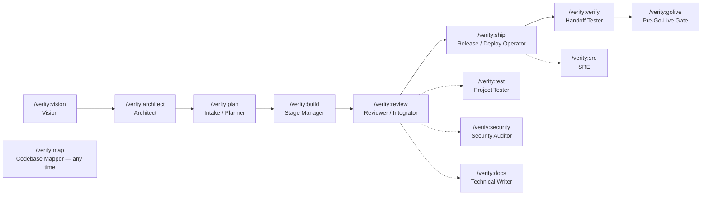

# Verity — AI Explainer Kit

> **What this file is.** A single, self-contained briefing an AI agent can use to
> explain Verity to humans — to generate a **podcast script**, a **slide deck**, a
> conference talk, a blog post, or an elevator pitch. It carries the facts, the
> story, the diagrams, sample code, audience-tuned framings, quotable lines, and
> ready-made outlines.
>
> **How to use it.** Pull what fits the format and audience. For a podcast, lean on
> *The Origin Story* (§2) and *Analogies* (§9). For a deck, use *Architecture* (§4),
> *Lifecycle* (§5), and the *Presentation Outline* (§11). For accuracy, anchor every
> claim to the *Fact Sheet* (§15) — do **not** invent numbers, dates, or features
> beyond what is stated here. Where something is illustrative (e.g. example JSON), it
> is labelled as such, because some exact formats are implementation-defined.

---

## Table of contents

1. [The pitch, at three altitudes](#1-the-pitch-at-three-altitudes)
2. [The origin story (the heart of any talk)](#2-the-origin-story-the-heart-of-any-talk)
3. [The mental model & five pillars](#3-the-mental-model--five-pillars)
4. [Architecture: five subsystems](#4-architecture-five-subsystems)
5. [The lifecycle: three arcs over an always-on pipeline](#5-the-lifecycle-three-arcs-over-an-always-on-pipeline)
6. [The cast: thirteen roles](#6-the-cast-thirteen-roles)
7. [Key concepts, with code](#7-key-concepts-with-code)
8. [What it actually looks like to run](#8-what-it-actually-looks-like-to-run)
9. [Analogies & explaining to different audiences](#9-analogies--explaining-to-different-audiences)
10. [Soundbites to quote](#10-soundbites-to-quote)
11. [Presentation outline (slide by slide)](#11-presentation-outline-slide-by-slide)
12. [Podcast outline (segments & talking points)](#12-podcast-outline-segments--talking-points)
13. [FAQ & misconceptions](#13-faq--misconceptions)
14. [Glossary](#14-glossary)
15. [Fact sheet (ground truth for accuracy)](#15-fact-sheet-ground-truth-for-accuracy)

---

## 1. The pitch, at three altitudes

**One sentence:**
> Verity turns AI coding into *verified production delivery* — it doesn't stop when
> the code is written; it keeps going until the software is tested, deployed, and
> proven working in front of a user.

**Thirty seconds:**
> Most AI coding tools generate code and call it done. But "code exists" isn't
> "software works." Verity runs a project the way a seasoned engineering team would —
> through specialized AI roles (architect, builder, reviewer, release operator,
> verifier) that hand work off through clear contracts, with **GitHub as the single
> source of truth**. CI/CD is the spine: every change has to *earn green* and be
> *observably working on the live app* before it counts as done.

**Two minutes:**
> Verity is a CI/CD-native, GitHub-native, production-lifecycle AI software delivery
> framework. It's the part *after* vibe coding. You describe what you want; a sequence
> of specialized AI roles designs it, builds each piece in isolation, adversarially
> reviews it, releases it, deploys it, and then drives the *real interface* like a user
> to confirm it actually works.
>
> Three things make it different from a one-shot code generator. **First, GitHub is
> the substrate** — issues, pull requests, Actions, tags, and deployments *are* the
> state, so there's no stale "task file" or unreliable agent memory to drift. **Second,
> CI/CD is the spine, not an afterthought** — the pipeline exists before any feature
> and gates everything; "done" means *proven green and observably working*. **Third,
> it models the whole production lifecycle**, not a single pass: a continuous stream
> of feature-stages riding an always-on pipeline, plus ongoing operations — releases,
> security, recovery, secret rotation.
>
> It ships as one npm package, `verity-framework`, installs into your AI assistant
> (Claude Code or OpenCode) as thirteen role commands, and is a clean-room successor
> to an earlier framework called spec-driven-devops — rebuilt from the lessons of a
> real production app.

---

## 2. The origin story (the heart of any talk)

Verity was not designed in the abstract. It was **generalized from a real, beyond-MVP
production build** — a multi-service app (codename *Switchboard*) built largely by AI
agents over roughly fifteen stages, deployed to real servers. Every place that build
*diverged* from the "standard" single-agent AI-coding flow was logged as a divergence,
D1 through D9. Verity is the framework that would have made those divergences
unnecessary. Three pain points drove the entire design:

### Pain #1 — "Done" that wasn't: the phantom-progress disaster (D4)

Nine of about fifteen stages were marked **done** — "code written, tests written, CI
configured" — *before the continuous-integration pipeline had ever actually run green
once.* When CI finally ran for real, it failed four different ways at once, and a
tangle of test-design debt lingered for days — hiding a *real production bug* the
whole time.

The lesson: **"tests exist" is not "tests pass." "CI is configured" is not "CI is
green."** A pipeline that's green only because it's empty is a lie. The standard flow
had no concept of CI/CD as a gate that must be *proven*. So Verity makes the very
first thing you build a **walking skeleton** — the thinnest possible end-to-end slice
(one route, one database read, one real test) that must go green in CI *and* deploy
*and* pass a live check **before any feature work is allowed to start.**

> **The soundbite:** *"They marked nine stages done before the pipeline was ever green
> once. The pipeline wasn't passing — it was empty. Verity makes 'empty green' impossible."*

### Pain #2 — "Merged ≠ works in the browser": the hotfix treadmill (D8)

A steady drip of `+1` hotfixes — a stub that rendered nothing, a cache-stale UI, a
help button that was wired to nothing, a version number that lied about itself. **Every
one of those passed CI and a `/health` check and still shipped broken**, because CI
tested the backend and the contracts but never *clicked the button a user clicks.*

It got worse when the project lost its independent tester — the one role whose entire
job was to act as a skeptical end-user with no access to the source. Once that
"second pair of eyes" collapsed into the same agent doing everything, regressions sailed
straight through. The single highest-leverage thing that would have helped: a mandatory
**"deployed-and-observably-works" gate** — a headless browser that drives the real
interface after every deploy and asserts *behavior*, not a health endpoint.

That's Verity's **Verify** subsystem and its **Handoff Tester** role: an adversarial
end-user with no source access, run on the *live* app, who turns every failure it finds
into a permanent automated UI-smoke check so it can never regress again.

> **The soundbite:** *"CI was green. Health checks passed. The button did nothing.
> Verity's answer: prove it works by clicking it — on the live app, every deploy."*

### Pain #3 — the boring seams: identity, deploy, and operations

The genuinely hard part wasn't the AI. It was the *plumbing*: a registry that needed a
different identity than the git account; manual copy-paste of image digests into deploy
config; branch protection being paywalled on a private repo; servers that powered down
at night to save money; secrets that lived only on the VMs and **never got rotated**.

The meta-surprise of the whole build: **the human/CI/platform plumbing was the hard
part; the agent collaboration was the easy part.** Two independent agent systems
building one app "just worked" over plain git + pull requests + a markdown brief — zero
merge conflicts, no message bus, no lock service. *The repo itself was the coordination
bus.* That single insight reorders the framework's priorities: invest in the
pipeline / identity / verification spine, and trust the git-mediated handoff.

So Verity bakes in an **identity manifest** locked on day one, an automated digest-pin
step, an "is the environment asleep or actually down?" runbook, a single-writer runtime-
truth file (`STATUS.md`), and a **pre-go-live gate** that force-closes the "fine until
real data" list — secret rotation, throwaway accounts, backup coverage, cross-user
isolation — before the first real user shows up.

> **The thesis in one line:** *"The framework should treat operating a real,
> cost-constrained, secret-bearing deployment as seriously as it treats writing the code —
> because that operational half is where the real project actually spent its surprises."*

---

## 3. The mental model & five pillars

The whole framework rests on one idea, stated five ways:

| Pillar | Plain-English meaning |
|---|---|
| **Brain vs. Notebook** | The AI (a *role*) makes the judgment calls. A deterministic command-line tool (`verity`) performs the file and GitHub operations. Reliability lives in the boring, deterministic layer — not in the model's memory. |
| **State is derived, never authored** | There is no "progress file" anyone edits. A state change *is* a GitHub act — open a PR, merge it, push a tag, close an issue. "What's done" is *computed by reading GitHub*, so it can't drift or go stale. |
| **Contracts are mandates; guides are recommendations; every deviation is a record** | The interfaces between components are frozen early and only ever *added to*, never broken. Design suggestions are optional. Any architectural decision or deviation is written down as an append-only decision record (an ADR). |
| **Done = green** | "Done" means *proven green in CI and observably working on the live app* — not "the code got written." A pipeline that's green only because it's empty doesn't count. |
| **The slug is the identity** | The project's name/slug is locked once, at the very start, and becomes the immutable key for the repo, container images, DNS, environment names, and secrets. Renaming later is a migration, not an edit. |

**Why "brain vs. notebook" matters for the demo:** it's *why* Verity is portable. Roughly
90% of Verity's behavior lives in the deterministic `verity` engine (Node + `git` +
`gh`). The AI harness on top — Claude Code, OpenCode — is a thin adapter. So Verity
"runs everywhere, and quality scales with the model."

---

## 4. Architecture: five subsystems

Verity ships as **one package** but is described internally as five subsystems. These are
the names to use on an architecture slide.



| Subsystem | One-liner | What it owns |
|---|---|---|
| **Relay** | Role-based AI delivery orchestration. | Moves work architect → builder → reviewer → operator → verifier through clear contracts and visible state transitions. The dependency engine that knows what can run next. |
| **Shipyard** | Where AI-built software becomes production-ready. | Build/test/release/deploy pipeline, release packaging, the Release/Deploy Operator, and `STATUS.md` (the runtime-truth file). |
| **Ledger** | Project truth from real engineering records. | Reads true state from GitHub activity — merged work, releases, deployments, checks, issues. No stale task files, no agent memory. |
| **Gate** | Every change must pass before it ships. | Adversarial code review, security invariants, test gates, and the blocking checkpoints (walking-skeleton, UI-smoke, pre-go-live). |
| **Verify** | Verification against the real app, not just the code. | Drives the deployed app from the user's point of view — clicks the button, inspects the result — and proves the feature works live. |

---

## 5. The lifecycle: three arcs over an always-on pipeline

The macro-shape: a **one-time bootstrap**, then a **looping stream** of feature-stages,
plus **continuous operations** — all riding a pipeline that's always on.

```
 ① ONE-PASS BOOTSTRAP          ②  LOOPING STREAM (per feature)        ③ CONTINUOUS OPERATE
 Vision / Retrofit                 ┌───────────────────────────────┐    Release/Deploy Operator
   → Architect (freeze            │ intake/assess → build → CI →   │    SRE · Security · Tech Writer
     contracts) → Designer        │ review → merge → release →     │    pre-go-live gate
   → WALKING SKELETON (Stage 0)   │ deploy(→staging) → UI-smoke    │
   [green+deployed+smoked, or     │ VERIFY → (cut release→prod) →  │
    feature work is BLOCKED]      │ STATUS update                  │
                                  └──────────────▲────────┬────────┘
                                  └─────── loop ──────────┘
 ALWAYS-ON SUBSTRATE: CI/CD spine · GitHub (Issues/PRs/tags/Milestones/Deployments) ·
                      DERIVED state · STATUS.md · contracts · ADRs · feature catalog
 HUMAN GATE: once before Stage 0 (provision) + "env available?" before every deploy
```

- **① Bootstrap** runs *once*: lock identity, create the repo, scaffold governance +
  hygiene CI, freeze the core contracts, and prove the spine with a **walking skeleton**.
  This is the only linear arc. Until the skeleton is green-deployed-and-smoked, *all
  feature work is blocked.*
- **② Stream** is the bulk of the life of the project: a feature loop riding the
  constant pipeline. **Stages are born in exactly one place — intake (`/verity:plan`).**
- **③ Operate** runs continuously alongside the stream: releases, security audits,
  steady-state ops, documentation.

**The progressive gate timeline** (a great animated-slide moment):



The required-checks list **grows in lockstep** as the project earns each gate — and
honestly degrades to an honor-system + CI-on-push when the platform tier can't enforce
branch protection.

---

## 6. The cast: thirteen roles

Verity runs a project as a sequence of specialized roles, each invoked as a slash command.
The command name is short; the **role** is the specialist. (Full reference:
[`commands.md`](commands.md).)



| # | Command | Role | The one thing it does |
|---|---|---|---|
| 1 | `/verity:vision` | Vision | Clarify the idea, lock the project identity, scaffold the repo with honest hygiene CI. **Start here.** |
| 2 | `/verity:architect` | Architect | Stack + topology, **freeze contracts**, write ADRs, offer drop-in features, own the walking skeleton. |
| 3 | `/verity:plan` | Intake / Planner | The **only** place stages are born — assess a request, write the stage spec + work-item. |
| 4 | `/verity:build` | Stage Manager | Build one stage in isolation, open a green PR, hand off. **Never merges.** |
| 5 | `/verity:review` | Reviewer / Integrator | Adversarially review a PR *against the source*, then merge. The integration gate. |
| 6 | `/verity:test` | Project Tester | Guardian of test honesty: real, CI-like tests that pass from zero. |
| 7 | `/verity:security` | Security Auditor | Define the invariants the Reviewer enforces; run periodic deep audits. |
| 8 | `/verity:docs` | Technical Writer | Public/dev docs, the architecture narrative, and handoff briefs. |
| 9 | `/verity:ship` | Release / Deploy Operator | Cut a release, deploy to staging, UI-smoke, promote to prod, update `STATUS.md`. |
| 10 | `/verity:verify` | Handoff Tester | Adversarial end-user testing on the **live** app; re-verify after every deploy. |
| 11 | `/verity:golive` | Pre-Go-Live Gate | **Blocking** gate before real data: secrets rotated, throwaways gone, backups in place. |
| 12 | `/verity:sre` | SRE | Steady-state ops: recovery drills, backups, secret rotation, intermittent-env handling. |
| 13 | `/verity:map` | Codebase Mapper | On-demand structural code map. Available at any time. |

**The casting metaphor (good for a podcast):** *Verity is "built like a team, not a
chatbot."* The reviewer is deliberately **adversarial to the builder** — it did not
write the code and reviews against the real source, not the PR's own description. Even
when one agent plays every part, the **role boundary** keeps quality high: "now act as
the skeptical tester," "now as the security auditor," "now as the deploy operator."

---

## 7. Key concepts, with code

### 7.1 Brain vs. Notebook

The LLM never edits state files directly. It calls the deterministic engine.

```bash
# The "notebook": a deterministic CLI. JSON by default, --raw for plain values.
verity help
# → { "commands": [ "slug","timestamp","verify-path","config","identity",
#                   "scaffold","install","adr","contract","guides","feature",
#                   "stage","state","review","release","status","security",
#                   "handoff","map","recovery","golive","smoke" ], ... }

verity slug "My New Project" --raw     # → my-new-project   (deterministic, testable)
```

The *brain* decides *whether* to accept a feature, *how* to design it, *whether* a PR is
safe to merge. The *notebook* performs the act — create the branch, open the PR, push
the tag — the same way every time. Bugs in judgment are the model's; bugs in mechanics
can't happen, because the mechanics are plain, tested code.

### 7.2 State is derived, never authored

There is no `STATE.md` that anyone writes. **A state transition *is* a GitHub act**, and
state is *computed on read*:

| Transition | The act that causes it | Derived by reading |
|---|---|---|
| stage building | branch `feat/stage-N-*` / draft PR | the branch / PR |
| CI green | an Actions run | check-runs |
| merged | squash-merge `Closes #N` | PR merged / issue closed |
| released | push tag `vX.Y.Z` | the tag |
| deployed | a GitHub Deployment record | the Deployments API |
| verified | a UI-smoke result | deployment status / `STATUS.md` |

```bash
verity state view     # full projection: every stage + status, current release, what's live
verity state next     # unblocked stages = (depends-on) × (merged-status)
```

*Illustrative* shape (exact JSON is implementation-defined):

```jsonc
{
  "stages": [
    { "id": 0, "slug": "walking-skeleton", "status": "verified", "pr": 3, "release": "v0.0.1" },
    { "id": 1, "slug": "user-auth",        "status": "in-review", "pr": 7, "ci": "green" },
    { "id": 2, "slug": "billing",          "status": "planned",   "depends_on": [1] }
  ],
  "live": { "version": "v0.0.1", "env": "staging", "verified": true }
}
```

**Why it matters:** no drift, no "the file says done but it isn't," no merge-conflicts on
state, no write-contention when multiple agents work at once. The one honest limit:
*offline, you can't freshly derive* — issues, CI, and Deployments live behind the API.

### 7.3 Contracts (mandates) and ADRs (records)

```text
contracts/auth.md         ← the wire/JWT/schema between components. FROZEN. Additive-only.
docs/adr/0007-pick-postgres.md   ← an append-only decision record, with the reasoning.
```

Contracts are frozen early and only ever extended — *a new seam is a new contract, never
a break.* In the real build, one core contract held across fifteen stages without ever
breaking; that discipline is *why* iteration stayed safe on a live system. Every
deviation from a design guide becomes an ADR, authored by whichever role made the call,
at the moment it made it.

### 7.4 The walking skeleton (the non-negotiable gate)

```text
Stage 0 = the thinnest vertical slice that is:
   green in CI  →  built/scanned/digest-pushed  →  deployed to staging  →  UI-smoked.
Until that is true, EVERY feature stage is BLOCKED.
```

This single rule kills the phantom-progress disaster (§2, Pain #1) at the root: you
cannot pile nine stages of code on top of a pipeline that has never run.

### 7.5 Done = green & observably works

The Handoff Tester drives the *real* interface and refuses to fake a pass:

```text
UI-smoke (post-deploy): a headless browser logs in, sends a chat, clicks the help "?",
   clicks "File issue" — asserting BEHAVIOR, not a 200 from /health.
If it can't truly run (no browser available), it reports "NOT a pass" — never green-by-default.
Every failure it finds becomes a NEW permanent scripted check, so it can't regress.
```

### 7.6 The identity manifest (locked day one)

```jsonc
// Locked once, immutable. The whole scaffold is GENERATED from this.
{
  "slug": "switchboard",          // lowercase-canonical — registries demand it
  "repo": "owner/switchboard",
  "image_prefix": "ghcr.io/owner/switchboard-",
  "registry_owner": "owner",      // DECIDE registry-owner ↔ git-auth identity on day one
  "dns": "switchboard.example.com",
  "env_names": ["staging", "prod"],
  "secret_names": ["DB_URL", "JWT_SECRET"]
}
```

The casing trap and the registry-owner-vs-git-auth split were two of the most expensive
"boring" seams in the real build. Locking them on day one makes them a non-event.

---

## 8. What it actually looks like to run

**Install (once):**

```bash
npm i -g verity-framework
verity install --claude        # or: --opencode
# Prereqs: a GitHub account · Node ≥16 · git + gh installed AND signed in (gh auth login)
node -v && git --version && gh auth status      # preflight — all three answer without errors
```

**Start a brand-new app** — type these into your AI assistant, in order:

```text
/verity:vision        # name it, lock identity, create + scaffold the repo
/verity:architect     # stack, topology, freeze contracts, the walking skeleton
/verity:plan          # turn your first feature into a stage spec
/verity:build 1       # build that stage in isolation → opens a green PR
/verity:review 1      # adversarial review against source → merge
/verity:ship          # cut release → deploy to staging → UI-smoke → promote
/verity:verify        # drive the LIVE app as a user → prove it works
```

**Add a feature to an existing Verity project** — the steady-state loop:

```text
/verity:plan  →  /verity:build <n>  →  /verity:review <n>  →  /verity:ship  →  /verity:verify
```

**Behind the scenes**, each role calls the deterministic engine — for example, the Stage
Manager runs roughly:

```bash
verity stage branch 1        # create feat/stage-1-<slug> off main
# ... isolated build happens, tests written, kill-switch default-off ...
verity stage pr 1            # open a PR with the acceptance checklist + "Closes #N"
# ... drive CI green, then hand to the Reviewer, who runs:
verity review checklist 7    # emit the exact list to verify against source
verity review merge 7        # REFUSES if CI isn't green; squash + delete-branch
```

**The "first hour" of a perfect run** (a memorable talk beat):

1. **(0–10 min)** Lock the identity manifest.
2. **(10–20 min)** Generate the scaffold from it — repo, CI + release workflows, issue
   templates, an empty `STATUS.md`, pinned toolchain + lockfile.
3. **(20–35 min)** Build the **walking skeleton** — one route, one DB read, one real
   test — green in CI, tagged, deployed to staging, UI-smoked. *The entire spine is now
   proven before a single feature exists.*
4. **(35–40 min)** Set the gates (branch protection if the plan allows; otherwise record
   the honor-system fallback). Rehearse a rollback.
5. **(40–50 min)** Operator runbook + file the human-only prerequisites (provision
   servers, secrets, DNS) as `blocked-on-human` issues.
6. **(50–60 min)** First real feature through the loop.

> The ordering principle: **prove the CI/CD-and-verify spine on an empty skeleton in the
> first 35 minutes**, *then* let features stream over it.

---

## 9. Analogies & explaining to different audiences

**For a five-year-old / total non-technical listener:**
> Imagine building with LEGO. Most robots will snap the bricks together and say "done!"
> — even if the tower falls over. Verity is a robot that builds the tower, *then shakes
> the table to make sure it stands*, and only says "done" when it really does.

**For an executive / founder:**
> AI can write code fast, but "code written" isn't "product shipped." Verity is the
> discipline layer: it makes every AI-built change traceable, reviewed, deployed, and
> *verified on the live product* — so you can move fast without losing trust. It treats
> shipping, not typing, as the definition of done.

**For an engineer:**
> Think of it as a multi-agent pipeline where GitHub is the state store. No `STATE.md` —
> state is derived from PRs, checks, tags, and Deployments. Contracts are frozen and
> additive-only; deviations are ADRs. There's a brain/notebook split: a deterministic
> Node CLI (`git` + `gh`) does the acts, the model does the judgment. A mandatory
> walking-skeleton gate blocks features until the thin slice is green-deployed-smoked,
> and a post-deploy headless UI-smoke gate is what "done" actually means. Multi-agent
> isn't a subsystem — it's emergent from PR + CI being the integration model.

**For a DevOps / platform person:**
> It's CI/CD-as-spine for AI-built software. Progressive required-checks (hygiene → test
> → deploy → UI-smoke), digest-pinned deploys with re-pin rollback, a single-writer
> runtime-truth file, an "is the env asleep or down?" runbook, and a pre-go-live gate
> that forces secret rotation and backup coverage before real data. It degrades honestly
> when branch protection is paywalled.

**The competitive contrast slide:**

| Typical AI coding tool | Verity |
|---|---|
| Writes code | Ships **verified** changes |
| Relies on chat / session memory | Uses **GitHub as source of truth** |
| Optimized for prototypes | Built for **production delivery** |
| One agent does everything | **Specialized roles** with clear handoffs |
| Done = code exists | Done = **deployed and verified** |

---

## 10. Soundbites to quote

Short, punchy lines safe to use verbatim:

- **Prompt to production, proven.** *(the tagline)*
- **Code is not the finish line.**
- **Done means verified.**
- **The repo tells the truth.**
- **Shipping is the spine.**
- **Every change has to earn green.**
- **Built like a team, not a chatbot.**
- **No phantom progress. No stale agent memory.**
- **The framework for the part after vibe coding.**
- **A pipeline that's green only because it's empty is a lie.**
- **CI was green, health checks passed, and the button still did nothing — so prove it
  works by clicking it.**
- **The agent collaboration was the easy part; the plumbing was the hard part.**

---

## 11. Presentation outline (slide by slide)

A ~12-slide deck. Each bullet is a slide; the sub-line is the talking point.

1. **Title** — "Verity — Prompt to production, proven." *Set the promise.*
2. **The problem** — A wall of green CI checks next to a screenshot of a broken button.
   *"Code written" ≠ "software works."*
3. **The true story** — The phantom-progress disaster: nine stages "done" before the
   pipeline was ever green. *Pain #1.*
4. **The treadmill** — A drip of `+1` hotfixes that all passed CI. *Pain #2; introduce
   "merged ≠ works in the browser."*
5. **The reframing** — Done = green **and observably works.** *The thesis.*
6. **What Verity is** — One-sentence + two-minute pitch. GitHub-native, CI/CD-spine,
   production-lifecycle.
7. **The five pillars** — Brain/notebook · derived state · contracts · done=green · slug
   identity. *The mental model.*
8. **Architecture** — The five subsystems diagram (§4).
9. **The lifecycle** — Three arcs over an always-on pipeline + the progressive gate
   timeline (§5).
10. **The cast** — The thirteen-role handoff diagram (§6). *Built like a team.*
11. **Live demo / the first hour** — The walking skeleton in 35 minutes (§8).
12. **Close** — Competitive contrast table + tagline + `npm i -g verity-framework`.

---

## 12. Podcast outline (segments & talking points)

A ~25–30 minute two-voice (host + expert) episode. Beats, not a verbatim script.

**Cold open (0:00–1:00).** The hook: *"Nine stages of a real app were marked 'done' before
the build pipeline had ever once run green. When it finally ran, it failed four ways at
once — and it had been hiding a real production bug the whole time. That story is why
Verity exists."*

**Segment 1 — What even is this? (1:00–5:00).** Use the thirty-second and two-minute
pitches (§1). Land the core reframe: most AI tools stop at "code written"; Verity stops
at "deployed and proven."

**Segment 2 — The origin story (5:00–12:00).** Walk through the three pain points (§2).
This is the emotional center. Pain #1 (phantom progress), Pain #2 (the hotfix treadmill
and the lost tester), Pain #3 (the boring seams) — and the meta-surprise: *the plumbing
was hard, the agent collaboration was easy.*

**Segment 3 — How it actually works (12:00–19:00).** The five pillars (§3), especially
**brain vs. notebook** and **state-is-derived** (no STATE.md — the repo *is* the state).
Then the **walking skeleton** as the gate that makes phantom progress impossible.

**Segment 4 — Built like a team (19:00–23:00).** The thirteen roles (§6), the adversarial
reviewer, and *why the role boundary matters even when one agent plays every part.* The
Handoff Tester who clicks the real button.

**Segment 5 — Who's it for / try it (23:00–27:00).** Audience (solo builders shipping
serious apps, small teams, founders), the "first hour" arc (§8), install line, and the
honest positioning: *runs everywhere; quality scales with the model.*

**Listener-question lightning round (use the FAQ, §13).**

---

## 13. FAQ & misconceptions

**Q. Is this another AI code generator / Copilot competitor?**
No. Verity is a *delivery framework*, not a code-completion tool. It orchestrates the
whole path from idea to verified production release. Code generation is one step inside
it, not the product.

**Q. Where does it store project state — some database?**
No database, and no state file you edit. State is **derived from GitHub** — pull requests,
checks, tags, deployments, issues. The repo is the source of truth. (Trade-off: you need
to be online to freshly derive state.)

**Q. Does it require multiple AI agents / machines?**
No. It's **single-agent by default, multi-agent opt-in per feature.** Multi-agent
collaboration is *emergent* — it falls out of PR + CI being the integration model — not a
bolted-on subsystem. In the real build, two independent agent systems collaborated over
plain git + PRs with zero merge conflicts.

**Q. What does it actually need to run?**
A GitHub account, Node ≥16, and `git` + the GitHub CLI (`gh`) installed **and signed in**.
It installs into Claude Code or OpenCode. Installing `gh` is *not* the same as being
authenticated — that trips people up.

**Q. What's the relationship to spec-driven-devops?**
Verity is a **clean-room successor** to spec-driven-devops 1.4 — it borrows the *concepts*
(brain/notebook split, role sequencing, contracts-first discipline) but is built fresh
for projects that go *beyond MVP* into operated production. It keeps the things the old
flow got right (contracts, intake assessment, stage decomposition, role separation,
specs-as-committed-artifacts) and adds the production spine the old flow lacked.

**Q. Will it work with a local model (Ollama)?**
It *runs* there, but be honest: role quality scales with the model. Local models are fine
for mechanical roles, risky for judgment roles like architecture and adversarial review.
The positioning is "runs everywhere; quality scales with the model" — not parity.

**Q. What if the model hallucinates and breaks something?**
Two structural guards. First, the **brain/notebook split** means the model never performs
file/GitHub mechanics directly — a deterministic, tested CLI does. Second, the
**adversarial reviewer** and the **live Handoff Tester** are independent gates: a change
has to pass review-against-source and prove itself on the running app before it counts.

**Q. Isn't "AI that reviews its own work" just theater?**
The reviewer is deliberately adversarial and reviews against the *source*, not the change's
own description — and the final word is a *live* test of the deployed app. In the origin
project, the single biggest regression class came exactly from *losing* that independent
eyeball; Verity makes it structural.

---

## 14. Glossary

- **Walking skeleton** — the thinnest end-to-end slice (one route, one DB read, one real
  test) that must be green-in-CI, deployed, and UI-smoked before any feature work begins.
- **Derived state** — project state computed by reading GitHub (PRs, checks, tags,
  deployments) rather than stored in an editable file.
- **Brain / notebook** — the split between the LLM (judgment) and the deterministic
  `verity` CLI (file + GitHub mechanics).
- **Contract** — a frozen, additive-only interface between components (`contracts/*.md`).
  A mandate, not a suggestion.
- **ADR** — Architecture Decision Record: an append-only note capturing a decision or
  deviation and its reasoning (`docs/adr/*.md`).
- **Stage** — the unit of work. Born only at intake (`/verity:plan`), built in isolation,
  merged only through review.
- **UI-smoke** — a post-deploy headless-browser check that drives real user flows and
  asserts *behavior*, gating "release verified."
- **STATUS.md** — the single-writer runtime-truth file owned by the Release/Deploy
  Operator (live version, digests, caveats). Distinct from derived integration state.
- **Identity manifest** — the immutable day-one record fixing slug, repo, image prefix,
  registry owner, DNS, env names, and secret names.
- **Kill-switch / dark launch** — net-new features ship behind an off-by-default switch,
  so a problem is one flip away from off, not a redo.
- **Pre-go-live gate** — the blocking checklist before first real data: secret rotation,
  remove throwaway accounts, cross-user isolation, backup coverage, security sign-off.
- **Capability registry** — verified runtime-capability flags (e.g. image-gen, sub-agents)
  probed with a *real* test, since "available" ≠ "works."
- **Relay / Shipyard / Ledger / Gate / Verify** — the five internal subsystem names (§4).

---

## 15. Fact sheet (ground truth for accuracy)

Use these exact facts; do not invent beyond them.

- **Name:** Verity. **Tagline:** *Prompt to production, proven.*
- **Category:** AI software delivery framework (CI/CD-native, GitHub-native,
  production-lifecycle).
- **Package:** `verity-framework` on npm. **Version at time of writing:** 0.1.0.
  **CLI binary:** `verity`. **License:** MIT. **Author:** Sean Mahoney.
- **Host requirements:** Node ≥16.7, `git`, and the GitHub CLI (`gh`, authenticated).
- **Install:** `npm i -g verity-framework` then `verity install --claude` (or
  `--opencode`). **Start with:** `/verity:vision`.
- **Supported AI harnesses (adapters implemented):** Claude Code (reference) and
  OpenCode. (Codex / Gemini are discussed as future targets; **only Claude and OpenCode
  adapters are implemented.**)
- **Role commands:** **13** — vision, architect, plan, build, review, test, security,
  docs, ship, verify, golive, sre, map.
- **Five subsystems:** Relay (orchestration), Shipyard (CI/CD + release + `STATUS.md`),
  Ledger (GitHub-derived state), Gate (review + security + checkpoints), Verify (live
  verification).
- **Five pillars:** brain vs. notebook · state is derived, never authored · contracts are
  mandates / guides are recommendations / deviations are ADRs · done = green · the slug is
  the identity.
- **Lineage:** clean-room successor to spec-driven-devops 1.4 (borrows concepts, not
  code), generalized from a real beyond-MVP production build whose divergences from the
  standard flow were logged D1–D9.
- **Multi-agent model:** single-agent by default, multi-agent opt-in per feature;
  collaboration is emergent from PR + CI, not a separate subsystem.
- **Honest limits to state, not hide:** state derivation needs network/API (offline can't
  freshly derive); local-model quality is partial, not at parity; some exact CLI JSON
  shapes are implementation-defined.

**Things to NOT say** (common ways generated content goes wrong):
- Don't claim it has a web UI, a dashboard, or a hosted service — it's a CLI + a set of
  AI-assistant commands.
- Don't claim Codex or Gemini are supported today — they're discussed, not shipped.
- Don't claim a number of users, downloads, customers, or benchmarks — none are stated.
- Don't say it "guarantees bug-free code" — it makes changes *traceable, reviewed, and
  verified*; that's the honest claim.
- Don't describe a `STATE.md` — the entire point is that there isn't one.

---

*Sources in this repo for deeper detail: [`README.md`](../README.md) ·
[`commands.md`](commands.md) · [`framework-spec.md`](framework-spec.md) (build-ready
architecture) · [`roles-spec.md`](roles-spec.md) (full role rationale) ·
[`brand.md`](brand.md) (positioning) · [`interview-findings.md`](interview-findings.md)
(the forensic origin story) · the interactive guides
[`verity-overview.html`](verity-overview.html) / [`verity-usage.html`](verity-usage.html)
/ [`verity-flows.html`](verity-flows.html).*
